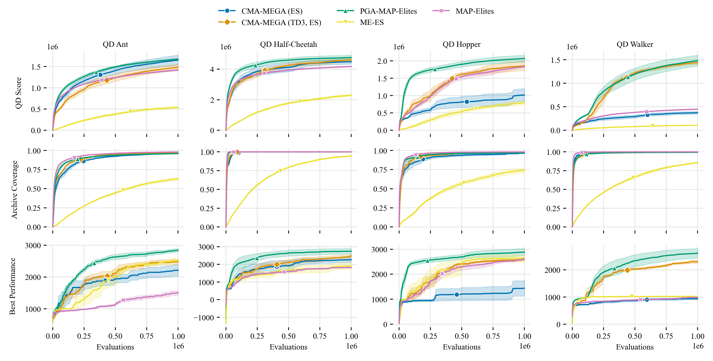
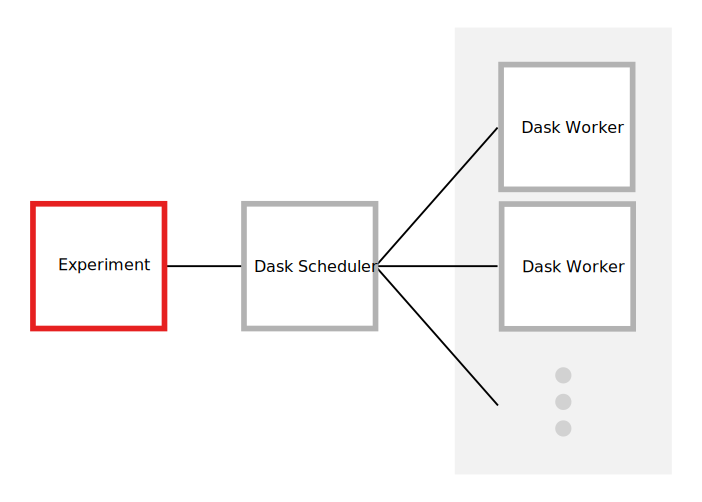

# Approximating Gradients for Differentiable Quality Diversity in Reinforcement Learning

This is the official implementation of "Approximating Gradients for
Differentiable Quality Diversity in Reinforcement Learning" by
[Bryon Tjanaka](https://btjanaka.net),
[Matt Fontaine](https://github.com/tehqin),
[Julian Togelius](http://julian.togelius.com), and
[Stefanos Nikolaidis](https://stefanosnikolaidis.net). Below is the abstract of
the paper:

> Consider the problem of training robustly capable agents. One approach is to
> generate a diverse collection of agent polices. Training can then be viewed as
> a quality diversity (QD) optimization problem, where we search for a
> collection of performant policies that are diverse with respect to quantified
> behavior. Recent work shows that differentiable quality diversity (DQD)
> algorithms greatly accelerate QD optimization when exact gradients are
> available. However, agent policies typically assume that the environment is
> not differentiable. To apply DQD algorithms to training agent policies, we
> must approximate gradients for performance and behavior. We propose two
> variants of the current state-of-the-art DQD algorithm that compute gradients
> via approximation methods common in reinforcement learning (RL). We evaluate
> our approach on four simulated locomotion tasks. One variant achieves results
> comparable to the current state-of-the-art in combining QD and RL, while the
> other performs comparably in two locomotion tasks. These results provide
> insight into the limitations of current DQD algorithms in domains where
> gradients must be approximated. Source code is available at
> https://github.com/icaros-usc/dqd-rl

For more info, visit the following links:

- [Website](https://dqd-rl.github.io)
- [arXiv](https://arxiv.org/abs/2202.03666)
- [Supplemental Material](https://www.dropbox.com/sh/adjj2w0mgphm9nu/AADXL4C8zyRNlS60STb62jGta?dl=0)

To cite this paper, please use the following bibtex:

```bibtex
@misc{tjanaka2022approximating,
  title         = {Approximating Gradients for Differentiable Quality Diversity
                   in Reinforcement Learning},
  author        = {Bryon Tjanaka and Matthew C. Fontaine and Julian Togelius
                   and Stefanos Nikolaidis},
  year          = {2022},
  eprint        = {2202.03666},
  archivePrefix = {arXiv},
  primaryClass  = {cs.LG},
  url           = {https://dqd-rl.github.io},
  note          = "\url{https://dqd-rl.github.io}",
}
```

We primarily use the [pyribs](https://pyribs.org/) library in this
implementation. If you use this code in your research, please also cite pyribs:

```bibtex
@misc{pyribs,
  title = {pyribs: A bare-bones Python library for quality diversity
           optimization},
  author = {Bryon Tjanaka and Matthew C. Fontaine and Yulun Zhang and
            Sam Sommerer and Nathan Dennler and Stefanos Nikolaidis},
  year = {2021},
  publisher = {GitHub},
  journal = {GitHub repository},
  howpublished = {\url{https://github.com/icaros-usc/pyribs}},
}
```

## Contents

<!-- vim-markdown-toc GFM -->

* [Manifest](#manifest)
* [Getting Started](#getting-started)
* [Running Experiments](#running-experiments)
  * [Logging Directory Manifest](#logging-directory-manifest)
  * [Running on Slurm](#running-on-slurm)
  * [Testing Experiments](#testing-experiments)
  * [Reloading](#reloading)
* [Running Analysis and Generating Figures](#running-analysis-and-generating-figures)
* [Results](#results)
* [Implementation](#implementation)
  * [Algorithms](#algorithms)
  * [Other Notable Files](#other-notable-files)
  * [Makefile](#makefile)
  * [Testing](#testing)
  * [Code Reading Tips](#code-reading-tips)
* [Miscellaneous](#miscellaneous)
* [License](#license)

<!-- vim-markdown-toc -->

## Manifest

- `config/`: [gin](https://github.com/google/gin-config) configuration files.
- `docs/`: Additional documentation.
- `src/`: Python implementations and related tools.
- `scripts/`: Bash scripts.

## Getting Started

1. **Clone the repo:** We include the development version of Seaborn as a
   submodule, so make sure to add `--recurse-submodules`.
   ```bash
   git clone --recurse-submodules https://github.com/icaros-usc/dqd-rl.git
   ```
1. **Install Singularity:** All of our code runs in a
   [Singularity / Apptainer](https://apptainer.org) container. See
   [here](https://apptainer.org/user-docs/master/quick_start.html) to install
   Singularity.
1. **Build or download the container:** Build the Singularity container with
   ```bash
   sudo make container.sif
   ```
   Alternatively,
   [download the container here](https://www.dropbox.com/s/evy5n941ra4sfl4/container.sif?dl=0)
   and place it in the root directory of this repo.
1. **(Optional) Install NVIDIA drivers and CUDA:** The node where the main
   script runs should have a GPU with NVIDIA drivers and CUDA installed (we have
   not included CUDA in the container). This is only necessary if you are
   running algorithms which use TD3.

## Running Experiments

There are two commands for running experiments.

1. `scripts/run_local.sh` runs on a local machine:
   ```bash
   bash scripts/run_local.sh CONFIG SEED NUM_WORKERS
   ```
   Where `CONFIG` is a [gin](https://github.com/google/gin-config) file in
   `config/`, `SEED` is a random integer seed (we used values from 1-100), and
   `NUM_WORKERS` is the number of worker processes.
2. `scripts/run_slurm.sh` runs on a SLURM cluster:
   ```bash
   bash scripts/run_slurm.sh CONFIG SEED HPC_CONFIG
   ```
   Here, `HPC_CONFIG` is the path to a config in `config/hpc`. It specifies the
   number of nodes on the cluster and the number of workers per node.

In our paper, we evaluated five algorithms (CMA-MEGA (ES), CMA-MEGA (TD3, ES),
PGA-MAP-Elites, ME-ES, MAP-Elites) in four environments (QD Ant, QD
Half-Cheetah, QD Hopper, QD Walker). We have included config files for all of
these experiments. To replicate results from the paper, you will need to run
each of the following commands 5 times with different random seeds.

```bash
# QD Ant
bash scripts/run_slurm.sh config/qd_ant/cma_mega_es.gin SEED config/hpc/100.sh
bash scripts/run_slurm.sh config/qd_ant/cma_mega_td3_es.gin SEED config/hpc/100_gpu.sh
bash scripts/run_slurm.sh config/qd_ant/pga_me.gin SEED config/hpc/100_gpu.sh
bash scripts/run_slurm.sh config/qd_ant/me_es.gin SEED config/hpc/100_high_mem.sh
bash scripts/run_slurm.sh config/qd_ant/map_elites.gin SEED config/hpc/100.sh

# QD Half-Cheetah
bash scripts/run_slurm.sh config/qd_half_cheetah/cma_mega_es.gin SEED config/hpc/100.sh
bash scripts/run_slurm.sh config/qd_half_cheetah/cma_mega_td3_es.gin SEED config/hpc/100_gpu.sh
bash scripts/run_slurm.sh config/qd_half_cheetah/pga_me.gin SEED config/hpc/100_gpu.sh
bash scripts/run_slurm.sh config/qd_half_cheetah/me_es.gin SEED config/hpc/100_high_mem.sh
bash scripts/run_slurm.sh config/qd_half_cheetah/map_elites.gin SEED config/hpc/100.sh

# QD Hopper
bash scripts/run_slurm.sh config/qd_hopper/cma_mega_es.gin SEED config/hpc/100.sh
bash scripts/run_slurm.sh config/qd_hopper/cma_mega_td3_es.gin SEED config/hpc/100_gpu.sh
bash scripts/run_slurm.sh config/qd_hopper/pga_me.gin SEED config/hpc/100_gpu.sh
bash scripts/run_slurm.sh config/qd_hopper/me_es.gin SEED config/hpc/100_high_mem.sh
bash scripts/run_slurm.sh config/qd_hopper/map_elites.gin SEED config/hpc/100.sh

# QD Walker
bash scripts/run_slurm.sh config/qd_walker/cma_mega_es.gin SEED config/hpc/100.sh
bash scripts/run_slurm.sh config/qd_walker/cma_mega_td3_es.gin SEED config/hpc/100_gpu.sh
bash scripts/run_slurm.sh config/qd_walker/pga_me.gin SEED config/hpc/100_gpu.sh
bash scripts/run_slurm.sh config/qd_walker/me_es.gin SEED config/hpc/100_high_mem.sh
bash scripts/run_slurm.sh config/qd_walker/map_elites.gin SEED config/hpc/100.sh
```

These commands run with 100 workers, but more workers would not help since we
only evaluate 100 solutions at a time. To run locally, replace `run_slurm.sh`
with `run_local.sh` and pass a number of workers instead of an HPC config:

```bash
bash scripts/run_local.sh config/qd_ant/cma_mega_es.gin SEED 100
```

Regardless of whether experiments are run locally or on a cluster, all results
are placed in a _logging directory_ under `logs/`. The directory's name is of
the form `logs/%Y-%m-%d_%H-%M-%S_dashed-name`, e.g.
`logs/2020-12-01_15-00-30_experiment-1`. Refer to the
[logging directory manifest](#logging-directory-manifest) for a list of files in
the directory. `run_slurm.sh` additionally outputs a separate directory which
stores the stdout of the scheduler and workers; see [below](#running-on-slurm)
for more info.

See [below](#running-analysis-and-generating-figures) for how to analyze results
and generate figures.

The remainder of this section provides useful info for running experiments.

### Logging Directory Manifest

Each logging directory contains the following files:

```text
- config.gin                  # All experiment config variables, lumped into one file.
- seed                        # Text file containing the seed for the experiment.
- reload.pkl                  # Data necessary to reload the experiment if it fails.
- reload_td3.pkl              # Pickle data for TD3 (only applicable in some experiments).
- reload_td3.pth              # PyTorch models for TD3 (only applicable in some experiments).
- metrics.json                # Metrics like QD score; intended for MetricLogger.
- all_results.pkl             # All returns and BCs from function evaluations during the run.
- hpc_config.sh               # Same as the config in the Slurm dir, if Slurm is used.
- archive/                    # Snapshots of the full archive, including solutions and
                              # metadata, in pickle format.
- archive_history.pkl         # Stores objective values and behavior values necessary
                              # to reconstruct the archive. Solutions and metadata are
                              # excluded to save memory.
- slurm_YYYY-MM-DD_HH-MM-SS/  # Slurm log dir (only exists if using Slurm).
                              # There can be a few of these if there were reloads.
  - config/
    - [config].sh             # Copied from `hpc/config`
  - job_ids.txt               # Job IDs; can be used to cancel job (scripts/slurm_cancel.sh).
  - logdir                    # File containing the name of the main logdir.
  - scheduler.slurm           # Slurm script for scheduler and experiment invocation.
  - scheduler.out             # stdout and stderr from running scheduler.slurm.
  - worker-{i}.slurm          # Slurm script for worker i.
  - worker-{i}.out            # stdout and stderr for worker i.
```

### Running on Slurm

> In addition to a logging directory, `run_slurm.sh` outputs a Slurm directory
> with items like the content of stdout on scheduler and workers. To move these
> into the logging directory, run `slurm_postprocess.sh` (see below).

There are a number of helpful utilities associated with Slurm scripts. These
reminders are output on the command line by `run_slurm.sh` after it executes:

- `tail -f ...` - Use this to monitor stdout and stderr of the main experiment
  script.
- `bash scripts/slurm_cancel.sh ...` - This will cancel the job.
- `ssh -N ...` - This will set up a tunnel from the HPC to your laptop so you
  can monitor the Dask dashboard. Run this on your _local_ machine.
- `bash scripts/slurm_postprocess.sh ...` - This will move the slurm logs into
  the logging directory. Run it _after_ the experiment has finished.

You can monitor the status of your slurm experiments with:

```bash
watch scripts/slurm_dashboard.sh
```

Since the dashboard output can be quite long, it can be useful to scroll through
it. For this, consider an alternative to `watch`, such as
[viddy](https://github.com/sachaos/viddy).

### Testing Experiments

To test an experiment configuration with smaller settings, add `_test` to the
end of a name, e.g. `config/qd_ant/cma_mega_es.gin_test`. Then, the original
config (`config/qd_ant/cma_mega_es.gin`) and `config/test.gin` will be included.

### Reloading

While the experiment is running, its state is saved to "reload files" (AKA
checkpoints) in the logging directory. If the experiment fails, e.g. due to
memory limits, time limits, or network connection issues, run this command with
the name of the existing logging directory:

```bash
bash scripts/slurm_reload.sh LOGDIR
```

This will continue the job with the exact same configurations as before. For
finer-grained control, refer to the `-r` flag in `run_slurm.sh`. `run_local.sh`
also provides an option for reloading:

```bash
bash scripts/run_local.sh CONFIG SEED NUM_WORKERS LOGDIR
```

## Running Analysis and Generating Figures

Refer to `src/analysis/figures.py` and `src/analysis/supplemental.py`.

## Results

The following plot shows all metrics for all algorithms after 1 million
evaluations. Refer to the appendix of our paper for final numerical values.



## Implementation

Each experiment is structured as shown in the following diagram.
[Dask](https://dask.org) is the distributed compute library we use. When we run
an experiment, we connect to a Dask scheduler, which is in turn connected to one
or more Dask workers. Each component runs in a [Singularity](https://sylabs.io)
container.



### Algorithms

The algorithm implementations are primarily located in the following files:

- `CMA-MEGA (ES)` and `CMA-MEGA (TD3, ES)`:
  `src/emitters/gradient_improvement_emitter.py`
- `PGA-ME`: `src/emitters/pga_emitter.py`, `src/emitters/gaussian_emitter.py`
- `ME-ES`: `src/me_es/` (adapted from
  [authors' implementation](https://github.com/uber-research/Map-Elites-Evolutionary))
- `MAP-Elites`: `src/emitters/gaussian_emitter.py`

### Other Notable Files

- `src/main.py`: Entry point for all experiments.
- `src/manager.py`: Handles all experiments that are implemented with pyribs.
- `src/objectives/gym_control/`: This is the code that evaluates all solutions
  in the QDGym environments.

### Makefile

The Makefile has several useful commands. Run `make` for a full command
reference.

### Testing

There are some tests alongside the code to ensure basic correctness. To run
these, start a Singularity container with:

```bash
make shell
```

Within that container, execute:

```bash
make test
```

### Code Reading Tips

To understand the code, it will be useful to be familiar with the following
libraries:

- [pyribs](https://pyribs.org)
- [dask](https://dask.org)
- [gin](https://github.com/google/gin-config)

## Miscellaneous

- In the codebase, we refer to `behavior_values` and `BCs` (behavior
  characteristics). These are synonymous with `measures` in the paper.
- We use `PGA-ME` and `PGA-MAP-Elites` interchangeably in the code.
- We also use `iterations` and `generations` interchangeably.
- In our code (specifically `src/manager.py`), we measure `Robustness` on every
  iteration. However, this metric is only the robustness of the best-performing
  solution. The `Mean Robustness` that we describe in the paper is computed in a
  separate script (`src/analysis/robustness.py`) after experiments are
  completed.

## License

This code is released under the [MIT License](LICENSE), with the following
exceptions:

- The `src/me_es/` directory is derived from
  [Colas 2020](https://arxiv.org/pdf/2003.01825.pdf)
  ([repository](https://github.com/uber-research/Map-Elites-Evolutionary)) and
  is released under the [Uber Non-Commercial License](src/me_es/LICENSE).
- The `src/qd_gym/` directory is adapted from Olle Nilsson's
  [QDgym](https://github.com/ollenilsson19/QDgym) and is released under an
  [MIT license](src/qd_gym/LICENSE).
